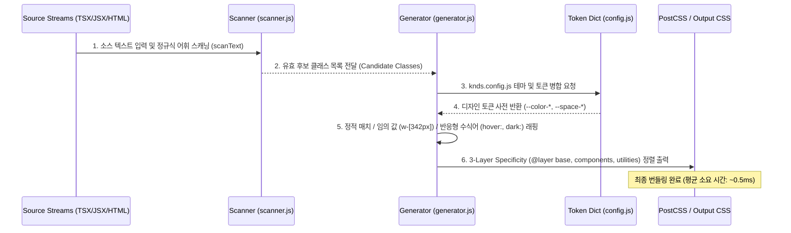

# KNDS (Knoblab Design System)

**피지컬-디지털 융합 웹 디자인 언어 및 온디맨드 JIT 유틸리티 프레임워크 명세서**

[](https://github.com/knoblab/KNDS/releases/latest)
[]()
[]()

KNDS(`@knoblab/knds`)는 오디오 하드웨어 기기의 조작감과 촉각적 피드백(Tactile Feedback)을 디지털 구조적 미니멀리즘과 결합하기 위해 설계된 무채색(Achromatic) 고대비 디자인 시스템 및 CSS 유틸리티 컴파일러 프레임워크입니다. 정적 스타일시트 단일 CDN 배포 체계와 함께, 소스 코드 분석을 통해 동적 임의 값 및 상태 수식어를 실시간으로 생성하는 Just-In-Time (JIT) 컴파일러 엔진을 제공합니다.

---

## 1. 시스템 아키텍처 및 듀얼 배포 모드

KNDS는 프로젝트의 빌드 체인 복잡도에 따라 두 가지 독립된 스타일시트 생성 및 배포 파이프라인을 제공합니다.

```mermaid
graph TD
    subgraph ModeA ["Mode A: Zero-Build Static Stylesheet (CDN)"]
        A1[HTML / Prototype Files] -->|Direct Link Tag Reference| A2["knds.css (Master Static Bundle: ~46 KB)"]
        A2 -->|Instant Browser Rendering| A3[Hardware Bevel & UI Tokens]
    end

    subgraph ModeB ["Mode B: On-Demand JIT Compiler Engine (Vite / Next.js / CLI)"]
        B1["Source Code Streams (.html, .tsx, .vue, .svelte)"] -->|Regex Tokenization ~0.5ms| B2["compiler/scanner.js (Lexical Scanner)"]
        B2 -->|Candidate Classes Extract| B3["compiler/generator.js (Rule & Arbitrary Parser)"]
        B3 -->|Theme Extrapolate & Layering| B4["@layer base, components, utilities"]
        B4 -->|PostCSS 8 / CLI Bundling| B5["dist/output.css (Optimized Bundle: < 5 KB)"]
    end
```



### Mode A: 제로 빌드 마스터 정적 스타일시트 (CDN)
외부 빌드 도구 없이 즉각적인 프로토타이핑 및 정적 HTML 환경에서 사용하기 위한 배포 모드입니다. 전체 마스터 유틸리티 및 기본 컴포넌트(`knds.css`)를 CDN을 통해 즉시 로드합니다.

```html
<!DOCTYPE html>
<html lang="ko">
<head>
  <meta charset="UTF-8">
  <meta name="viewport" content="width=device-width, initial-scale=1.0">
  <title>KNDS Static Terminal</title>
  <link rel="stylesheet" href="https://cdn.jsdelivr.net/gh/knoblab/KNDS@main/knds.css">
</head>
<body class="knds-bg-primary knds-text-primary">
  <main class="knds-panel knds-p-400 knds-max-w-xl knds-mx-auto knds-mt-400 knds-shadow-bevel">
    <div class="knds-panel-header knds-flex-row knds-justify-between knds-items-center knds-border-bottom knds-pb-200 knds-mb-300">
      <span class="knds-text-label-14-mono knds-text-red">SYSTEM READY #AD1D1D</span>
      <span class="knds-badge">v1.0.0</span>
    </div>
    <h1 class="knds-text-heading-32 knds-font-bold knds-mb-200">Knoblab Design Language</h1>
    <p class="knds-text-copy-14 knds-text-muted knds-mb-400">Achromatic precision interface engineered for high-density control panels.</p>
    <button class="knds-btn-primary knds-btn-md">
      <span>Execute Action</span>
    </button>
  </main>
</body>
</html>
```

---

## 2. JIT 컴파일러 파이프라인 명세

Vite, Next.js, Webpack 등의 모던 빌드 도구 환경에서 사용되는 온디맨드 JIT 컴파일러 엔진(`@knoblab/knds/compiler`)의 내부 동작 워크플로우는 다음과 같습니다.



### JIT 엔진 핵심 모듈별 기능 명세
1. **어휘 스캐너 (`compiler/scanner.js`)**: 무거운 외부 AST 파서 대신 최적화된 정규 표현식(`/[^<>"'`\s,;{}()]+/g`)을 사용하여 HTML, React(`JSX/TSX`), Vue 등 모든 텍스트 스트림에서 유효한 클래스 후보 문자열을 파일당 평균 `0.5ms` 이내에 고속 추출합니다.
2. **동적 규칙 및 임의 값 생성기 (`compiler/generator.js`)**: 추출된 후보 문자열을 바탕으로 정적 유틸리티 규칙(`knds.css` 기반 Balanced-Brace 추출)을 인덱싱하고, 대괄호 구문(`w-[342px]`, `p-[1.5rem]`, `grid-cols-[1fr_2fr]`, `bg-[#121212]`)을 온디맨드로 이스케이프(`\`) 처리하여 CSS 규칙으로 동적 변환합니다.
3. **수식어 체인 및 레이어 제어**: `hover:`, `focus:`, `active:`, `dark:`, `sm:`, `md:` 등 중첩된 수식어 체인을 해당 미디어 쿼리 및 의사 선택자로 감싸고, `@layer base, components, utilities;` 규칙에 따라 계층화하여 CSS Specificity 충돌 및 `!important` 오남용을 원천 방지합니다.

---

## 3. 핵심 디자인 토큰 및 물리학 명세

KNDS는 장식적 요소를 배제하고 기능성 및 가압 피드백에 집중하는 엄격한 토큰 사전을 기반으로 작동합니다.

| 토큰 분류 | CSS 변수명 | 설정 값 / 수식 | 기능 및 물리적 명세 |
| :--- | :--- | :--- | :--- |
| **무채색 고대비 바탕** | `--color-bg-primary`<br>`--color-text-primary` | `#ffffff` / `#09090b` (`:root`)<br>`#09090b` / `#f4f4f5` (`dark`) | 색수차 없는 즉각적인 텍스트 식별 및 다크 모드 자동 스위칭 보장 |
| **하드웨어 입체 베벨** | `--shadow-hardware-bevel` | `inset 0 1px 0 rgba(255,255,255,0.8),`<br>`0 1px 3px rgba(0,0,0,0.12)` | 물리적 기계 가공 표면의 상단 정반사 하이라이트와 하단 외곽 그림자 표현 |
| **가압 물리 피드백** | `:active` 콤보 변환 | `transform: scale(0.98);`<br>`box-shadow: inset 0 2px 4px ...` | 버튼 클릭 시 하드웨어 키보드 스위치가 압축되는 물리적 깊이감 및 피드백 구현 |
| **기능성 레드 포인트** | `--color-functional-red` | `#ad1d1d` (`knds-text-red`)<br>`knds-border-red` | 주요 액션 트리거, 시스템 경고 및 활성 상태 인디케이터에만 제한적 사용 |
| **블루프린트 정합 그리드** | `--blueprint-grid-pattern` | `24px x 24px linear-gradient` | 컨트롤 패널 간격 및 엔지니어링 정렬 검증용 정밀 그리드 오버레이 |

---

## 4. 설정 및 CLI / PostCSS 연동

### 설정 파일 명세 (`knds.config.js`)
프로젝트 루트 디렉토리에 `knds.config.js`를 생성하여 소스 경로 및 커스텀 토큰을 정의합니다.

```javascript
/** @type {import('@knoblab/knds').Config} */
export default {
  content: [
    './index.html',
    './src/**/*.{js,ts,jsx,tsx,vue,svelte,html}',
    './template/**/*.html'
  ],
  prefix: 'knds-',
  theme: {
    extend: {
      colors: {
        'surface-dark': '#09090b',
        'surface-muted': '#18181b'
      },
      spacing: {
        'custom-header': '88px',
        'console-pad': '32px'
      }
    }
  },
  safelist: [
    'knds-indicator-dot',
    'knds-btn-primary',
    'knds-shadow-bevel'
  ]
};
```

### 독립 실행형 CLI 인터페이스 (`npx knds`)
`@knoblab/knds` 패키지는 실행 가능한 CLI 바이너리를 포함하고 있습니다.

```bash
# 설정 파일에 지정된 경로를 스캔하여 필요한 CSS만 추출 및 최적화 빌드
npx knds -i knds.css -o dist/output.css --minify

# 개발 환경에서 소스 코드 변경을 실시간 감지(15ms 이내 증분 컴파일)하는 Watch 모드
npx knds -i knds.css -o dist/output.css --watch
```

### PostCSS 8 연동 (`postcss.config.js`)
Vite, Next.js 등의 모던 프론트엔드 환경에서 빌드 파이프라인과 원활히 통합하려면 다음과 같이 플러그인을 등록합니다.

```javascript
// postcss.config.js
import postcssKnds from '@knoblab/knds/postcss';

export default {
  plugins: [
    postcssKnds({ config: './knds.config.js' })
  ]
};
```

이후 진입점 CSS 파일 상단에 `@knds` 지시어를 선언합니다.

```css
/* src/index.css */
@knds base;
@knds components;
@knds utilities;
```

---

## 5. 저장소 디렉토리 아키텍처

```
KNDS/
 ├── knds.css                 # 마스터 정적 스타일시트 (CDN 배포 및 기본 CSS 규칙 정의서)
 ├── knds.config.js           # 표준 JIT 설정 파일 샘플
 ├── package.json             # bin("knds") 및 PostCSS/Core 서브패스 exports 정의
 ├── compiler/                # JIT 컴파일러 Core 모듈
 │    ├── config.js           # 디자인 토큰 사전 및 구성 병합기
 │    ├── scanner.js          # 정규식 기반 고속 어휘 스캐너 (AST-Free Regex Scanner)
 │    ├── generator.js        # Balanced-Brace 구문 파서 및 3-Layer CSS 제너레이터
 │    ├── index.js            # compile() 프로그래밍 코어 API 진입점
 │    ├── postcss.js          # PostCSS 8 플러그인 모듈 (postcss-knds)
 │    └── cli.js              # 터미널 CLI 실행 스크립트
 ├── template/                # 프레임워크별 스타터 템플릿
 │    ├── starter-html/       # HTML + CDN 정적 스타터
 │    └── starter-vite/       # Vite + TypeScript + React JIT 스타터
 ├── test/                    # 자동화 검증 및 성능 벤치마크 테스트 스위트
 └── docs/                    # Apple HIG 명세서 기반 대화형 기술 문서 SPA (Vite / TSX)
      └── src/components/
           ├── CodeViewer.tsx # 멀티 탭(HTML/TSX/CSS) 및 복사/라인 넘버링 지원 코드 뷰어
           ├── CodeExport.tsx # 프로젝트 번들 및 스타터 템플릿 실시간 다운로드 바
           └── ...            # 15개 컴포넌트별 물리 엔지니어링 샌드박스
```

---

## 6. 품질 검증(QA) 및 자동화 테스트 스위트

KNDS의 JIT 엔진 및 디자인 시스템 명세 준수 여부를 검증하려면 루트 자동화 테스트 스크립트를 실행합니다.

```bash
node test/jit.test.js
```

### 품질 검증 및 컴플라이언스 기준
* **Token Integrity**: 모든 CSS 변수(`--space-*`, `--color-*`, `--shadow-*`) 및 유틸리티 규칙이 마스터 명세와 일치해야 합니다.
* **Touch Target Standard**: 모바일 및 터치 컨트롤 환경에서 오작동 방지를 위해 버튼 및 폼 컴포넌트는 최소 `44x44px` 이상의 물리적 터치 영역(`knds-btn-md`, `knds-input-md`)을 갖춰야 합니다.
* **Red Accent Compliance**: 기능성 레드(`#AD1D1D`)는 오직 주 액션 트리거, 실행 버튼, 시스템 경고 인디케이터에만 한정하여 사용해야 하며 일반 텍스트나 장식적 배경으로 사용을 금지합니다.

---

## 7. License

MIT License © Knoblab Design Team.
