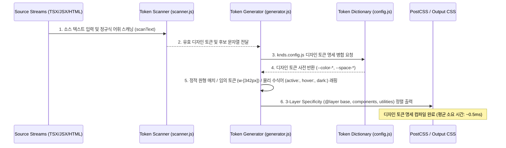

# KNDS (Knoblab Design Language Specification)

**피지컬-디지털 융합 인터페이스 디자인 언어 및 토큰 명세 엔진 (Physical-Digital Fusion Interface Grammar & Token Engine)**

[](https://github.com/knoblab/KNDS/releases/latest)
[]()
[]()

`@knoblab/knds`(KNDS)는 단순한 유틸리티 CSS 도구를 넘어, **오디오 하드웨어 기기의 정밀한 조작감과 촉각적 피드백(Tactile Feedback)**을 디지털 구조적 미니멀리즘과 결합하기 위해 설계된 **Knoblab 공식 디자인 언어 명세서 및 토큰 컴파일 엔진**입니다.

Dieter Rams의 기능주의 철학과 하드웨어 다이얼/스위치에서 영감을 받은 **5대 디자인 공리(Design Axioms)**를 바탕으로, 불필요한 장식적 요소를 엄격히 배제하고 명확한 층위(Layer)와 물리적 가압 응답성을 보장하는 고밀도 인터페이스 문법을 제공합니다.

---

## 1. 디자인 언어 철학 및 5대 핵심 공리 (Design Axioms & Philosophy)

KNDS의 모든 토큰과 컴포넌트 원형은 다음 5가지 불변의 디자인 공리를 철저히 준수하여 설계되었습니다.

### 공리 1: 무채색 고대비 명도 체계 (`Achromatic Contrast Equality`)
- 인터페이스 표면에서 색수차(Chromatic Aberration)와 무분별한 색상 오용을 차단하고, **순수 흰색(`#ffffff`)과 극단적 딥 블랙(`#09090b`)의 대비**만으로 시각적 계층과 구조적 판독성을 구축합니다.
- 조도 환경 변화에 따라 표면 명도 계수가 즉각 반전되는 완벽한 다크 모드 대칭성(`Dark Mode Symmetry`)을 보장합니다.

### 공리 2: 하드웨어 입체 베벨 표면 물리학 (`Physical Hardware Bevel Mechanics`)
- 평면적 디지털 UI의 한계를 넘어, 물리적 알루미늄 다이얼 및 오디오 하드웨어 패널의 가공 표면을 수학적 CSS 수식으로 재현합니다.
- 상단 인셋 하이라이트(`inset 0 1px 0 rgba(255,255,255,0.8)`)와 하단 외곽 앰비언트 그림자(`0 1px 3px rgba(0,0,0,0.12)`)의 결합을 통해 표면 입체감을 구현합니다.

### 공리 3: 결정론적 가압 물리 피드백 (`Deterministic Actuation Feedback`)
- 사용자의 모든 상호작용 트리거(버튼 클릭, 스위치 토글)는 기계적 기계식 스위치가 눌리는 물리적 복원력을 수반해야 합니다.
- 가압 시 표면 축소(`transform: scale(0.98)`)와 그림자 반전(`box-shadow: inset 0 2px 4px rgba(0,0,0,0.2)`)을 통해 촉각적 100% 응답 신뢰성을 전달합니다.

### 공리 4: 기능성 단일 액센트 제약 (`Strict Functional Red Regulation`)
- 기능성 레드(`#ad1d1d`)는 장식적 배경이나 일반 그래픽 요소에 사용할 수 없습니다.
- 오직 **시스템 준비 완료(`SYSTEM READY`), 주요 작동 트리거(Primary Actuator), 치명적 상태 경고**에만 제한적으로 할당하여 시각적 인지 신호의 우선순위를 절대적으로 보호합니다.

### 공리 5: 8px / 24px 정합 그리드 문법 (`Precision Blueprint Alignment`)
- 모든 컴포넌트 간격, 여백, 타이포그래피 행간은 기계 정밀 계측 규격인 8px 및 24px 블루프린트 그리드 시스템에 종속되어 기계적 오차 0%의 정렬을 유지합니다.

---

## 2. 핵심 물리 디자인 토큰 및 컴포넌트 원형 명세 (Physical Design Tokens & Archetypes)

KNDS는 자의적인 스타일 오버라이드를 방지하고 규격을 일관되게 유지하기 위한 물리 디자인 토큰 사전을 정의합니다.

| 토큰 분류 | CSS 변수 및 클래스명 | 설정 값 / 수식 | 기능 및 물리적 명세 |
| :--- | :--- | :--- | :--- |
| **무채색 고대비 표면** | `--color-bg-primary`<br>`--color-text-primary` | `#ffffff` / `#09090b` (`:root`)<br>`#09090b` / `#f4f4f5` (`dark`) | 색수차 없는 즉각적인 텍스트 판독성 및 다크 모드 자동 대칭 반전 보장 |
| **하드웨어 입체 베벨** | `--shadow-hardware-bevel`<br>`.knds-shadow-bevel` | `inset 0 1px 0 rgba(255,255,255,0.8),`<br>`0 1px 3px rgba(0,0,0,0.12)` | 물리 가공 컨트롤 패널의 상단 정반사 하이라이트와 하단 그림자 조합 |
| **가압 복원 피드백** | `:active` 콤보 상태 변환<br>`.knds-btn-primary:active` | `transform: scale(0.98);`<br>`box-shadow: inset 0 2px 4px ...` | 물리적 스위치 압축 압력 및 깊이감을 재현하는 즉각적 촉각 변환 |
| **기능성 레드 시그널** | `--color-functional-red`<br>`.knds-text-red` | `#ad1d1d` (`rgb(173, 29, 29)`) | 주요 동작 트리거, 시스템 상태 경고 및 인디케이터 전용 시그널 컬러 |
| **블루프린트 정합 그리드** | `--blueprint-grid-pattern`<br>`.knds-blueprint-grid` | `24px x 24px linear-gradient` | 컨트롤 패널 정렬 검증 및 배경 구조화를 위한 엔지니어링 그리드 오버레이 |

### 대표 컴포넌트 원형 (Component Archetypes)
- **`.knds-panel`**: 고대비 베벨 표면(`--shadow-hardware-bevel`)과 패딩을 가진 독립 하드웨어 컨트롤 패널 단위.
- **`.knds-btn-primary`**: 가압 피드백(`scale(0.98)`)과 기능성 레드 시그널(`active` 경계선 하이라이트)이 결합된 기본 구동 스위치.
- **`.knds-indicator-dot`**: 실시간 시스템 상태(`Ready / Alert / Off`)를 발광(`box-shadow: 0 0 8px`) 효과로 나타내는 하드웨어 LED 원형.

---

## 3. 디자인 토큰 컴파일 및 배포 아키텍처 (`Token Compilation & Delivery Engine`)

KNDS는 디자인 언어의 무결성을 유지하면서도, 개발 환경의 요구사항에 맞추어 **정적 명세서 참조 모드(Mode A)**와 **온디맨드 토큰 컴파일러 모드(Mode B)**라는 두 가지 전달 체계를 제공합니다.

```mermaid
graph TD
    subgraph ModeA ["Mode A: Zero-Build Master Token Stylesheet (CDN)"]
        A1[HTML / Prototype Files] -->|Direct Link Tag Reference| A2["knds.css (Master Token & Archetype Sheet: ~46 KB)"]
        A2 -->|Instant Browser Rendering| A3[Hardware Bevel & Precision Tokens]
    end

    subgraph ModeB ["Mode B: On-Demand Design Token Compiler Engine (Vite / Next.js / CLI)"]
        B1["Source Code Streams (.html, .tsx, .vue, .svelte)"] -->|Regex Lexical Scanning ~0.5ms| B2["compiler/scanner.js (Token Candidate Extractor)"]
        B2 -->|Archetype & Token Match| B3["compiler/generator.js (Balanced-Brace & Rule Generator)"]
        B3 -->|Grammar Extrapolate & Layering| B4["@layer base, components, utilities"]
        B4 -->|PostCSS 8 / CLI Bundling| B5["dist/output.css (Optimized Bundle: < 5 KB)"]
    end
```



### 1) Mode A: 제로 빌드 마스터 정적 토큰 스타일시트 (`CDN Mode`)
별도의 번들러 없이 정적 HTML이나 프로토타이핑 환경에서 디자인 언어 전체 규격(`knds.css`)을 즉시 참조합니다.

```html
<!DOCTYPE html>
<html lang="ko">
<head>
  <meta charset="UTF-8">
  <meta name="viewport" content="width=device-width, initial-scale=1.0">
  <title>KNDS Hardware Terminal</title>
  <link rel="stylesheet" href="https://cdn.jsdelivr.net/gh/knoblab/KNDS@main/knds.css">
</head>
<body class="knds-bg-primary knds-text-primary">
  <main class="knds-panel knds-p-400 knds-max-w-xl knds-mx-auto knds-mt-400 knds-shadow-bevel">
    <div class="knds-panel-header knds-flex-row knds-justify-between knds-items-center knds-border-bottom knds-pb-200 knds-mb-300">
      <span class="knds-text-label-14-mono knds-text-red">SYSTEM READY #AD1D1D</span>
      <span class="knds-badge">v1.0.0</span>
    </div>
    <h1 class="knds-text-heading-32 knds-font-bold knds-mb-200">Knoblab Design Language</h1>
    <p class="knds-text-copy-14 knds-text-muted knds-mb-400">Achromatic precision interface engineered for high-density control panels.</p>
    <button class="knds-btn-primary knds-btn-md">
      <span>Actuate Switch</span>
    </button>
  </main>
</body>
</html>
```

### 2) Mode B: 온디맨드 디자인 토큰 컴파일러 시퀀스 (`Compiler Mode`)
소스 코드에서 실제로 사용된 디자인 토큰과 컴포넌트 원형만을 정확히 추출하여, 3계층 Specificity 규칙(`@layer base, components, utilities`)으로 정렬된 초경량 스타일시트를 온디맨드로 생성합니다.



#### 컴파일러 코어 모듈별 기능 명세
1. **어휘 스캐너 (`compiler/scanner.js`)**: 무거운 외부 AST 파서 대신 최적화된 정규 표현식(`/[^<>"'`\s,;{}()]+/g`)을 사용하여 HTML, React(`JSX/TSX`), Vue 등 모든 소스 텍스트에서 디자인 토큰 후보를 파일당 평균 `0.5ms` 이내에 고속 추출합니다.
2. **원형 및 토큰 제너레이터 (`compiler/generator.js`)**: 추출된 후보를 기반으로 컴포넌트 원형(`knds.css` 기반 Balanced-Brace 규칙)과 대괄호 임의 토큰(`w-[342px]`, `grid-cols-[1fr_2fr]`)을 온디맨드로 이스케이프(`\`) 처리하여 CSS 규칙으로 동적 변환합니다.
3. **물리 상태 수식어 계층 제어**: `active:`, `hover:`, `focus:`, `dark:`, `sm:` 등 중첩된 물리 수식어 체인을 해당 미디어 쿼리와 의사 선택자로 감싸고, Specificity 충돌 방지 명세(`@layer`)에 따라 자동 정렬합니다.

---

## 4. 설정 및 CLI / PostCSS 토큰 연동 명세

### 디자인 언어 설정 파일 (`knds.config.js`)
프로젝트 루트 디렉토리에 `knds.config.js`를 생성하여 스캐닝 대상 경로와 Knoblab 디자인 토큰 확장을 선언합니다.

```javascript
/** @type {import('@knoblab/knds').Config} */
export default {
  // 1. 디자인 토큰 및 컴포넌트 원형을 스캐닝할 소스 파일 패턴
  content: [
    './index.html',
    './src/**/*.{js,ts,jsx,tsx,vue,svelte,html}',
    './template/**/*.html'
  ],

  // 2. 디자인 언어 접두사 문법 (기본값: 'knds-')
  prefix: 'knds-',

  // 3. Knoblab 디자인 토큰 명세 및 물리적 상수에 대한 확장
  theme: {
    extend: {
      colors: {
        'brand-accent': '#ad1d1d',
        'surface-dark': '#09090b',
      },
      spacing: {
        'custom-header': '88px',
      }
    }
  },

  // 4. 온디맨드 컴파일 시 강제 보존할 핵심 물리 스위치 및 인디케이터 패턴
  safelist: [
    'knds-indicator-dot',
    'knds-btn-primary',
    'knds-shadow-bevel'
  ]
};
```

### CLI 인터페이스 (`npx knds`)
터미널 환경에서 디자인 토큰 컴파일러 엔진을 직접 구동합니다.

```bash
# 지정된 소스를 스캔하여 필요한 디자인 토큰만 추출 및 최적화 빌드
npx knds -i knds.css -o dist/output.css --minify

# 개발 환경에서 디자인 토큰 변경을 실시간 감지(15ms 이내 증분 컴파일)하는 Watch 모드
npx knds -i knds.css -o dist/output.css --watch
```

### PostCSS 8 플러그인 연동 (`postcss.config.js`)
Vite, Next.js 등의 모던 파이프라인에서 토큰 컴파일러를 연동합니다.

```javascript
// postcss.config.js
import postcssKnds from '@knoblab/knds/postcss';

export default {
  plugins: [
    postcssKnds({ config: './knds.config.js' })
  ]
};
```

```css
/* src/index.css - 디자인 언어 계층 진입점 선언 */
@knds base;
@knds components;
@knds utilities;
```

---

## 5. 저장소 디렉토리 아키텍처 (Core Repository Layout)

`@knoblab/knds` 저장소 루트 디렉토리는 불필요한 레거시나 외부 문서 앱의 간섭 없이, **순수 디자인 시스템 명세서와 토큰 컴파일러 핵심 모듈**만으로 구성되어 있습니다.

```
KNDS/ (Root - Core Design Language Package)
 ├── package.json             # @knoblab/knds 패키지 진입점 및 CLI/PostCSS exports 명세
 ├── README.md                # 100% 기술 엔지니어링 명세서 및 시스템 아키텍처 다이어그램
 ├── knds.css                 # 마스터 디자인 토큰 및 컴포넌트 원형 시트 (~46 KB)
 ├── knds.config.js           # 표준 디자인 언어 설정 템플릿
 ├── compiler/                # 온디맨드 디자인 토큰 컴파일러 Core 엔진
 │    ├── config.js           # 디자인 토큰 사전 및 구성 병합기
 │    ├── scanner.js          # AST-Free 고속 어휘 스캐너 (~0.5ms)
 │    ├── generator.js        # Balanced-Brace 원형 파서 및 3-Layer 토큰 제너레이터
 │    ├── index.js            # compile() 프로그래밍 API 진입점
 │    ├── postcss.js          # PostCSS 8 플러그인 (postcss-knds)
 │    └── cli.js              # 터미널 CLI 컴파일러 실행 바이너리
 ├── test/                    # 토큰 엔진 무결성 및 벤치마크 검증 스위트
 │    ├── jit.test.js
 │    └── demo.html
 ├── template/                # 프로젝트 실무 즉시 적용 블루프린트
 │    ├── starter-html/       # HTML + CDN 정적 토큰 스타터
 │    └── starter-vite/       # Vite + TS + React 온디맨드 토큰 스타터
 └── docs/                    # [완전 격리] Apple HIG 가이드 기반 대화형 기술 문서 SPA
      ├── package.json        # @knoblab/knds-docs 독립 워크스페이스
      ├── index.html / vite.config.ts / tsconfig.json
      ├── public/             # 문서 전용 정적 자산 및 아이콘
      └── src/                # 인터랙티브 컴포넌트 명세서 앱 구현체
```

---

## 6. 라이선스 및 저작권 명세 (License)

이 프로젝트는 [MIT License](https://opensource.org/licenses/MIT)를 따릅니다.
Knoblab Design Team (`@knoblab/knds`) - All Rights Reserved.
